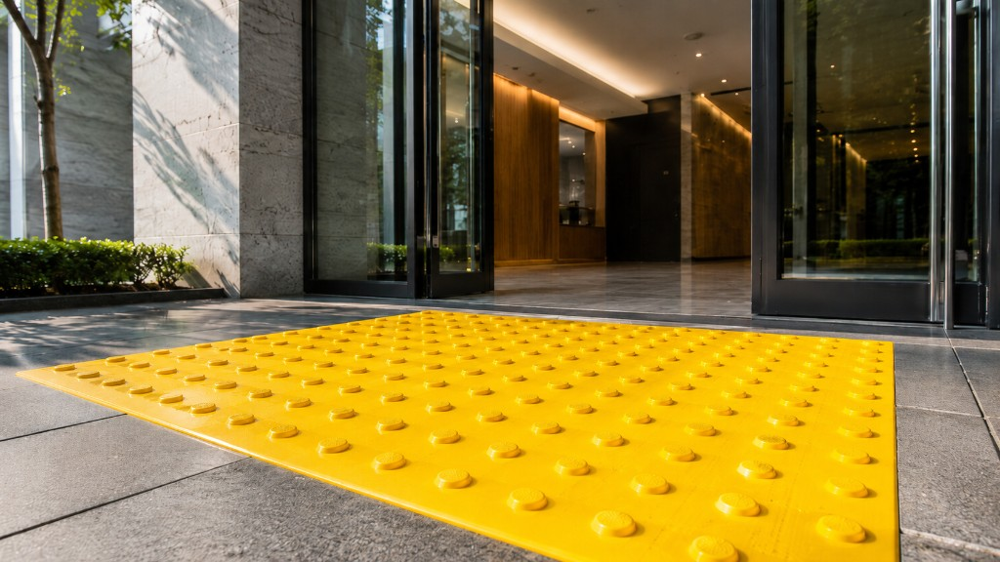

# Инструкция по монтажу тактильной плитки ПластФактор

**Электронный гайд и PDF-инструкция** по укладке тактильной плитки из ПВХ и ТПУ для общественных зданий, улиц и транспортной инфраструктуры.

[](https://kefir161-spec.github.io/tactil-plitka-installation-guide/)
[](https://kefir161-spec.github.io/tactil-plitka-installation-guide/tactil-plitka-installation-guide.pdf)
[](https://kefir161-spec.github.io/tactil-plitka-installation-guide/)



---

## О проекте

Тактильная плитка помогает людям с нарушением зрения ориентироваться в пространстве: показывает направление движения и предупреждает о препятствиях. Этот материал — **единый, наглядный и актуальный** источник знаний для всех, кто участвует в монтаже продукции **ПластФактор**.

Инструкция собрана в удобном веб-формате и **автоматически публикуется в PDF** — её можно открыть с телефона на объекте, отправить подрядчику ссылкой или распечатать для бригады.

> **Зачем это бизнесу:** один стандарт работ вместо разрозненных файлов, быстрый онбординг новых сотрудников, меньше ошибок при монтаже и проще приёмка готовых объектов.

---

## Для кого

| Аудитория | Что получает |
|-----------|--------------|
| **Монтажные бригады** | Пошаговый алгоритм от подготовки основания до прижима плитки |
| **Подрядчики** | Чёткие требования к материалам, клеям и срокам высыхания |
| **Отдел приёмки / контроля качества** | Чек-лист перед сдачей работ |
| **HR и обучение** | Готовый учебный материал для адаптации и внутренних курсов |
| **Проектировщики** | Сравнение ПВХ и ТПУ, требования к основанию по ГОСТ |

---

## Содержание (7 разделов)

| № | Раздел | Кратко о содержании |
|---|--------|---------------------|
| 1 | **Введение** | Назначение плитки, ключевые параметры, последовательность работ |
| 2 | **Материалы: ПВХ и ТПУ** | Сравнение материалов, область применения, визуальные примеры |
| 3 | **Требования к основанию** | Влажность, прочность, ровность, допустимые покрытия |
| 4 | **Подготовка и разметка** | Очистка, обезжиривание, грунтование, малярный скотч |
| 5 | **Грунтовки и клеи** | Каталог рекомендованных составов с характеристиками |
| 6 | **Укладка в помещении** | 5 этапов: замес клея → обезжиривание → нанесение → укладка → прижим |
| 7 | **Улица, безопасность, контакты** | Монтаж ТПУ на улице, СИЗ, чек-лист и контакты ПластФактор |

PDF-версия оформлена **на 7 печатных листах** — удобно для объекта и архива документации.

---

## Быстрые ссылки

| Формат | Ссылка |
|--------|--------|
| **Веб-инструкция** | https://kefir161-spec.github.io/tactil-plitka-installation-guide/ |
| **PDF (7 стр.)** | https://kefir161-spec.github.io/tactil-plitka-installation-guide/tactil-plitka-installation-guide.pdf |
| **Репозиторий** | https://github.com/kefir161-spec/tactil-plitka-installation-guide |

---

## Ключевые параметры монтажа

| Параметр | Значение |
|----------|----------|
| Стандарт | ГОСТ Р 52875-2018 |
| ПВХ | Для помещений |
| ТПУ | Для улицы и агрессивной среды |
| Шпатель | TKB A2 |
| Рабочее время клея | 20–30 мин |
| Прижим в помещении | 12–24 ч |
| Высыхание на улице | До 3–5 суток |

---

## Чек-лист перед сдачей работ

- [ ] Основание сухое, прочное, ровное и очищено от загрязнений
- [ ] Выполнено грунтование с учётом типа основания
- [ ] Границы укладки размечены малярным скотчем
- [ ] Клей перемешан по инструкции, нанесён шпателем A2
- [ ] Тыльная сторона плитки обезжирена
- [ ] Плитка уложена в пределах рабочего времени клея
- [ ] Выполнен прижим грузом 24 ч (на улице — до 3–5 сут высыхания)

---

## Контакты ПластФактор

| | |
|---|---|
| **Сайт** | [plastfactor.com](https://plastfactor.com/) |
| **Телефон** | 8 (800) 775-84-09 |
| **Адрес** | с. Крым, ул. 5-я Линия, 1 |
| **Режим работы** | 8:00–17:00, сб и вс — выходные |

---

## Технологии

Проект построен на **React + TypeScript + Vite**. Контент вынесен в отдельные данные — тексты и изображения легко обновлять без правки вёрстки. PDF генерируется автоматически при каждом обновлении `main` и публикуется вместе с сайтом через **GitHub Actions**.

---

## Локальный запуск (для разработчиков)

```bash
git clone https://github.com/kefir161-spec/tactil-plitka-installation-guide.git
cd tactil-plitka-installation-guide
npm install
npm run dev          # локальный просмотр
npm run build        # сборка для продакшена
npm run export:pdf   # генерация PDF
```

---

## Лицензия и использование

Материал предназначен для внутреннего обучения, работы с подрядчиками и информирования заказчиков. При распространении сохраняйте ссылку на актуальную версию инструкции.

---

<p align="center">
  <strong>ПластФактор</strong> · Тактильная плитка для доступной среды
  <br />
  <a href="https://kefir161-spec.github.io/tactil-plitka-installation-guide/">Открыть инструкцию</a>
  &nbsp;·&nbsp;
  <a href="https://kefir161-spec.github.io/tactil-plitka-installation-guide/tactil-plitka-installation-guide.pdf">Скачать PDF</a>
</p>
